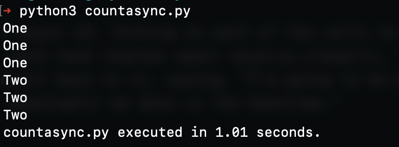
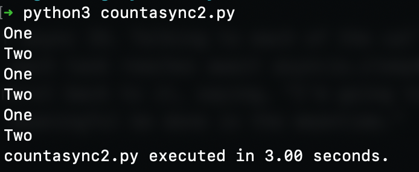
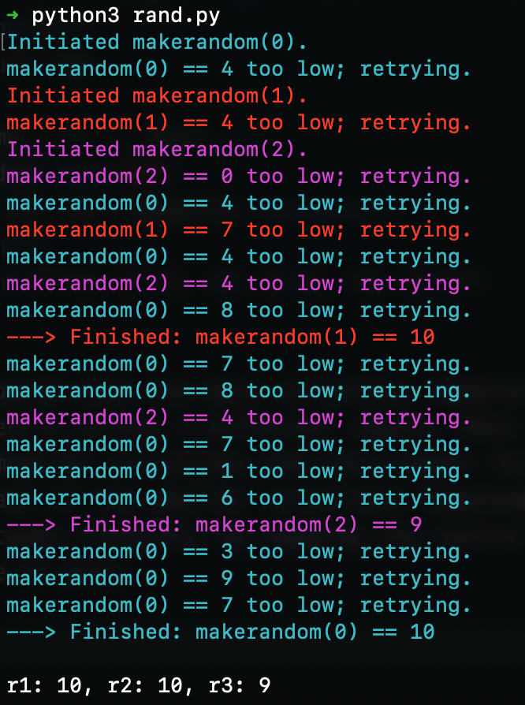
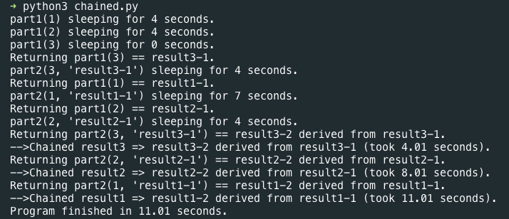
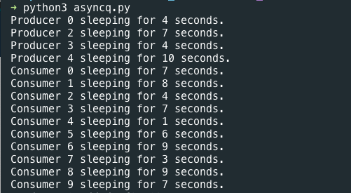

# Asynchronous Programming 

## An Introduction to Asynchronous Programming in Python
Asynchronous  programming it’s a hard concept in computer science and it’s more complicated to make use of it in a real scenario, on this lecture we onboard basic concepts of parallelism and concurrency all the way up to the async model. As we know async programming is a concurrent model of parallel computing in which the main process yields time or waits for new sub-tasks running concurrently to finish their processes, next up are a few examples of parallel programming making use of processes, threads and async model.  

### 1. Multiple Processes
Multi processes is the easiest way of applying parallelism, it consist of running the same program in separate processes, keeping in mind that these two programs running simultaneously  won’t be able to share common resources between them, so for certain tasks they are useless since they don't work together really well in and maybe be in some cases a resource overkill, since they a complete separate processes running in the cpu

### 2. Threading
In contrast of multiple processes multi treads can run in parallel inside the same process meaning thay can share resources, by definition a thread is a line of execution, pretty much like a process, but you can have multiple threads in the context of one process and they all share access to common resources.

In python we can access threading really easy by importing threading module
`import threading`

A mayor disadvantage for using threads is that is really hard to cordinate them, meaning there is no other mechanisim to control them, so can be very challenging to make concurrent code only using threads 

### 3. Coroutines
Coroutines and concurrency go hand by hand. Coroutines are a general control structure in wich flow control is cooperatively passed between two different routines without returning.

The 'yield' statement in Python is a good example. It creates a coroutine. When the 'yield ' is encountered the current state of the function is saved and control is returned to the calling function. The calling function can then transfer execution back to the yielding function and its state will be restored to the point where the 'yield' was encountered and execution will continue.

## Async IO

This short program is the Hello World of async IO

#### Asynchronous version

```python
import asyncio

async def count():
    print("One")
    await asyncio.sleep(1)
    print("Two")

async def main():
    await asyncio.gather(count(), count(), count())

if __name__ == "__main__":
    import time
    s = time.perf_counter()
    asyncio.run(main())
    elapsed = time.perf_counter() - s
    print(f"{__file__} executed in {elapsed:0.2f} seconds.")
```
The order of this output is the heart of async IO. Talking to each of the calls to count() is a single event loop, or coordinator. When each task reaches await the function talks to the event loop and gives control back to it.

### Output 


#### Synchronous version

```python
import time

def count():
    print("One")
    time.sleep(1)
    print("Two")

def main():
    for _ in range(3):
        count()

if __name__ == "__main__":
    s = time.perf_counter()
    main()
    elapsed = time.perf_counter() - s
    print(f"{__file__} executed in {elapsed:0.2f} seconds.")
```

These functions time.sleep() and asyncio.sleep() they are used as stand for any time-intensive processes that involve wait time. The function time.sleep() can represent any time consuming blocking function call, while asyncio.sleep() is used to stand in for a non-blocking call.

### Output 


## Coroutine


Let's see this example given a coroutine makerandom() that keeps producing random integers in the range [0, 10], until one of them exceeds a threshold, you want to let multiple calls of this coroutine.

```python
import asyncio
import random

# ANSI colors
c = (
    "\033[0m",   # End of color
    "\033[36m",  # Cyan
    "\033[91m",  # Red
    "\033[35m",  # Magenta
)

async def makerandom(idx: int, threshold: int = 6) -> int:
    print(c[idx + 1] + f"Initiated makerandom({idx}).")
    i = random.randint(0, 10)
    while i <= threshold:
        print(c[idx + 1] + f"makerandom({idx}) == {i} too low; retrying.")
        await asyncio.sleep(idx + 1)
        i = random.randint(0, 10)
    print(c[idx + 1] + f"---> Finished: makerandom({idx}) == {i}" + c[0])
    return i

async def main():
    res = await asyncio.gather(*(makerandom(i, 10 - i - 1) for i in range(3)))
    return res

if __name__ == "__main__":
    random.seed(444)
    r1, r2, r3 = asyncio.run(main())
    print()
    print(f"r1: {r1}, r2: {r2}, r3: {r3}")
```

This program uses one main coroutine, makerandom(), and runs it concurrently across 3 different inputs. Most programs will contain small, modular coroutines and one wrapper function that serves to chain each of the smaller coroutines together. main() is then used to gather tasks (futures) by mapping the central coroutine across some iterable or pool.

### Output 


## Async IO Design Patterns
Async IO comes with it's own set of posssible script designs.

### Chaining Coroutines
A key feature of coroutines is that they can be chained together. This allows us to break programs into smaller, manageable, recyclable coroutines.

```python
import asyncio
import random
import time


async def part1(n: int) -> str:
    i = random.randint(0, 10)
    print(f"part1({n}) sleeping for {i} seconds.")
    await asyncio.sleep(i)
    result = f"result{n}-1"
    print(f"Returning part1({n}) == {result}.")
    return result


async def part2(n: int, arg: str) -> str:
    i = random.randint(0, 10)
    print(f"part2{n, arg} sleeping for {i} seconds.")
    await asyncio.sleep(i)
    result = f"result{n}-2 derived from {arg}"
    print(f"Returning part2{n, arg} == {result}.")
    return result


async def chain(n: int) -> None:
    start = time.perf_counter()
    p1 = await part1(n)
    p2 = await part2(n, p1)
    end = time.perf_counter() - start
    print(f"-->Chained result{n} => {p2} (took {end:0.2f} seconds).")


async def main(*args):
    await asyncio.gather(*(chain(n) for n in args))

if __name__ == "__main__":
    import sys
    random.seed(444)
    args = [1, 2, 3] if len(sys.argv) == 1 else map(int, sys.argv[1:])
    start = time.perf_counter()
    asyncio.run(main(*args))
    end = time.perf_counter() - start
    print(f"Program finished in {end:0.2f} seconds.")

```
### Output 


## Queue
The asyncio package provides queue classes that are designed to be similar to classes of the queue module. In this design, there is no chaining of any individual consumer to a producer. The consumers don’t know the number of producers, or even the cumulative number of items that will be added to the queue, in advance.

It takes an individual producer or consumer a variable amount of time to put and extract items from the queue, respectively. The queue serves as a throughput that can communicate with the producers and consumers without them talking to each other directly.

```python

import asyncio
import itertools as it
import os
import random
import time


async def makeitem(size: int = 5) -> str:
    return os.urandom(size).hex()


async def randsleep(a: int = 1, b: int = 5, caller=None) -> None:
    i = random.randint(0, 10)
    if caller:
        print(f"{caller} sleeping for {i} seconds.")
    await asyncio.sleep(i)


async def produce(name: int, q: asyncio.Queue) -> None:
    n = random.randint(0, 10)
    for _ in it.repeat(None, n):  # Synchronous loop for each single producer
        await randsleep(caller=f"Producer {name}")
        i = await makeitem()
        t = time.perf_counter()
        await q.put((i, t))
        print(f"Producer {name} added <{i}> to queue.")


async def consume(name: int, q: asyncio.Queue) -> None:
    while True:
        await randsleep(caller=f"Consumer {name}")
        i, t = await q.get()
        now = time.perf_counter()
        print(f"Consumer {name} got element <{i}>"
              f" in {now-t:0.5f} seconds.")
        q.task_done()


async def main(nprod: int, ncon: int):
    q = asyncio.Queue()
    producers = [asyncio.create_task(produce(n, q)) for n in range(nprod)]
    consumers = [asyncio.create_task(consume(n, q)) for n in range(ncon)]
    await asyncio.gather(*producers)
    await q.join()  # Implicitly awaits consumers, too
    for c in consumers:
        c.cancel()

if __name__ == "__main__":
    import argparse
    random.seed(444)
    parser = argparse.ArgumentParser()
    parser.add_argument("-p", "--nprod", type=int, default=5)
    parser.add_argument("-c", "--ncon", type=int, default=10)
    ns = parser.parse_args()
    start = time.perf_counter()
    asyncio.run(main(**ns.__dict__))
    elapsed = time.perf_counter() - start
    print(f"Program completed in {elapsed:0.5f} seconds.")

```
The first few coroutines are helper functions that return a random string, a fractional-second performance counter, and a random integer. A producer puts anywhere from 1 to 5 items into the queue. Each item is a tuple of (i, t) where i is a random string and t is the time at which the producer attempts to put the tuple into the queue.

When a consumer pulls an item out, it simply calculates the elapsed time that the item sat in the queue using the timestamp that the item was put in with.

### Output 

