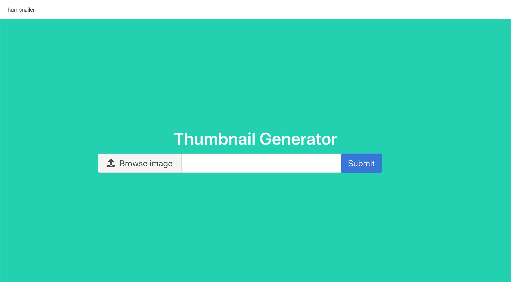

# Unidad 3

In this practice we will see a general understanding of why celery message queue's are valuable along with how to utilize celery in conjunction with Redis in a Django application. We'll build an image processing application that generates thumbnails of images submitted by users to demostrate how Celery works.

## Local Dev Setup

We need to create a new directory then inside it we will create a virtual enviroment.

```python
(venv) $ pip install Django Celery redis Pillow django-widget-tweaks
(venv) $ pip freeze > requirements.txt
```

### Setting up Django

We created a Django project named image_parroter then a Django app named thumbnailer.

```python
(venv) $ django-admin startproject image_parroter
(venv) $ cd image_parroter
(venv) $ python manage.py startapp thumbnailer
```

### Add Celery into Django Application

To integrate Celery with Django project we created a new module inside the image_parroter folder. 
THe following code show the code inside this module.

```python
import os
from celery import Celery

os.environ.setdefault('DJANGO_SETTINGS_MODULE', 'image_parroter.settings')

celery_app = Celery('image_parroter')
celery_app.config_from_object('django.conf:settings', namespace='CELERY')
celery_app.autodiscover_tasks()
```

### Configure of Celery to work with Redis
Next, We need to configure Celery to work with Redis so we put the code that you see below inside the settings.py file at the bottom.

```python
CELERY_BROKER_URL = 'redis://localhost:6379'
CELERY_RESULT_BACKEND = 'redis://localhost:6379'
CELERY_ACCEPT_CONTENT = ['application/json']
CELERY_RESULT_SERIALIZER = 'json'
CELERY_TASK_SERIALIZER = 'json'
```
### Run Django Application
The next command line run the django server
```python
(venv) $ python manage.py runserver
```
### Run Celery
The next command line run the celery
```python
(venv) $ celery worker -A image_parroter --loglevel=info
```

### Run Redis with Docker
We pull a image of Redis and created a Redis container. If the image doesn't exist the command run will create the container and then start running.
```docker
docker run -d -p 6379:6379 --name redis1 redis
```

### Application running
The Django server and Celery are running


